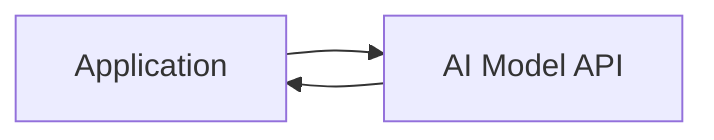
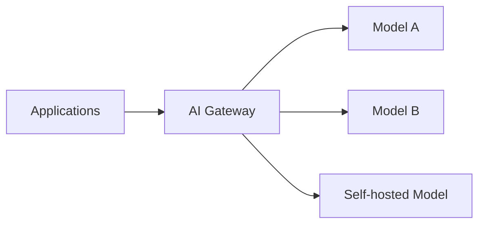

# AI Architecture

## Overview

AI system architecture defines how AI capabilities are integrated into production infrastructure. Poor architectural choices create technical debt, scaling problems, and observability gaps that are expensive to fix.

---

## Architecture Patterns

### Direct API Integration

The simplest pattern: application calls an AI model API directly.

**Pros:** Simple, fast to implement, low overhead.

**Cons:** Tight coupling to vendor, no abstraction layer, harder to switch models.

**When to use:** Early prototypes, low-volume, single-model applications.

---

### Gateway / Abstraction Layer

An internal service mediates all AI API calls.

**Pros:** Centralized logging, cost tracking, rate limiting, model routing, easier vendor switching.

**Cons:** Additional infrastructure, latency overhead, another system to maintain.

**When to use:** Multiple applications, multiple models, enterprise deployments.

---

### RAG Architecture

Retrieval-Augmented Generation adds a retrieval step to ground model responses in organizational data.

See [RAG Systems](rag-systems.md) for full detail.

---

### Agent Architecture

Autonomous agents take actions over multiple steps, using tools and APIs.

See [AI Agents](ai-agents.md) for full detail.

---

## Key Architectural Decisions

### Model Hosting

| Option | Control | Cost | Complexity | Privacy |
|---|---|---|---|---|
| Third-party API | Low | Variable | Low | Lower |
| Cloud-hosted (VPC) | Medium | Medium | Medium | Higher |
| Self-hosted | High | High | High | Highest |

Choose based on data sensitivity, volume, and cost profile.

### Prompt Management

Prompts are code. They should be:
- Version controlled
- Tested before deployment
- Auditable (who changed what, when)

Avoid hardcoding prompts in application code.

### Caching

AI API calls are expensive. Cache:
- Identical requests (exact match cache)
- Semantic-similar requests (embedding-based cache)

Define cache invalidation policy based on acceptable staleness.

---

## Related

- [RAG Systems](rag-systems.md)
- [AI Agents](ai-agents.md)
- [Observability](observability.md)
- [Deployment Models](deployment-models.md)
