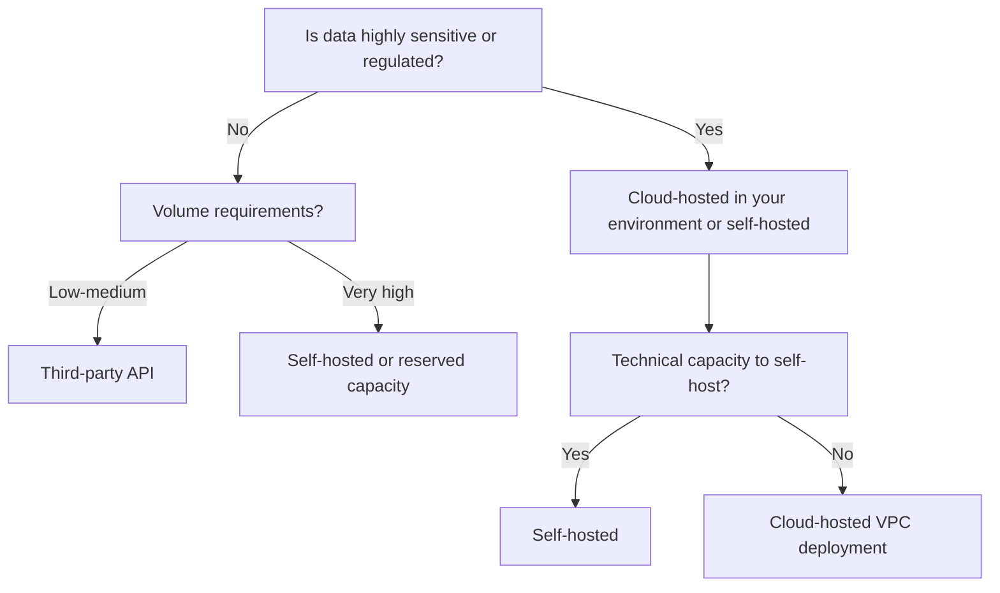

# Deployment Models

## Overview

Where and how AI models are deployed affects cost, performance, data privacy, and control. The right deployment model depends on the organization's data sensitivity requirements, volume, and technical capacity.

---

## Options

### Third-Party API

Use a hosted model API from a vendor (OpenAI, Anthropic, Google, etc.).

| Attribute | Detail |
|---|---|
| Setup | Minimal (API key + HTTP calls) |
| Control | Low (vendor controls model, infrastructure) |
| Data privacy | Lower (data leaves the organization) |
| Cost | Pay-per-token, variable |
| Maintenance | None (vendor manages) |
| Scaling | Automatic |

**Best for:** Prototypes, low-sensitivity data, applications where vendor model quality is the primary requirement.

---

### Cloud-Hosted in Your Environment

Deploy a model in your cloud account (AWS, Azure, GCP) within your network perimeter.

| Attribute | Detail |
|---|---|
| Setup | Medium (provisioning, deployment) |
| Control | Medium (you control infrastructure, vendor controls model) |
| Data privacy | Higher (data stays in your account) |
| Cost | Reserved instance or per-token, higher than API |
| Maintenance | Infrastructure managed by you |
| Scaling | Requires planning |

**Options:** Azure OpenAI (models deployed to your Azure subscription), AWS Bedrock, GCP Vertex AI.

**Best for:** Regulated industries requiring data residency, enterprise scale deployments.

---

### Self-Hosted Open Source

Run an open-source model (Llama, Mistral, etc.) on your own hardware or cloud infrastructure.

| Attribute | Detail |
|---|---|
| Setup | High (model deployment, serving infrastructure) |
| Control | Full (you control model and infrastructure) |
| Data privacy | Highest (data never leaves your environment) |
| Cost | Hardware/compute costs; no per-token fees at scale |
| Maintenance | Full responsibility |
| Scaling | Requires significant investment |

**Best for:** Very high volume (where per-token costs are prohibitive), maximum data control, fine-tuning requirements.

---

### Fine-Tuned Models

Base models fine-tuned on organization-specific data for improved task performance.

- Higher setup and data preparation cost
- Can produce better performance on narrow tasks
- Requires evaluation infrastructure to measure improvement
- Introduces model maintenance responsibility

Fine-tuning is appropriate when prompt engineering has reached its limits and consistent task-specific improvement is required.

---

## Decision Framework

---

## Related

- [AI Architecture](ai-architecture.md)
- [Security and Privacy](security-and-privacy.md)
- [Vendor Risk](../leadership/vendor-risk.md)
