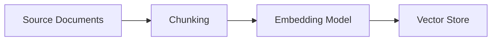
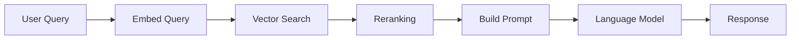

# RAG Systems

## Overview

Retrieval-Augmented Generation (RAG) is an architecture pattern that combines a retrieval system with a generative model. Rather than relying on information encoded in model weights, RAG retrieves relevant documents at query time and includes them in the model prompt.

---

## Why RAG

Base language models have limitations that RAG addresses:

| Problem | RAG Solution |
|---|---|
| Knowledge cutoff | Retrieve up-to-date documents |
| Hallucination | Ground answers in retrieved text |
| No access to proprietary data | Retrieve from internal knowledge base |
| Black-box citations | Show the source documents |

---

## Core Components

### Document Pipeline

1. **Chunking:** Split documents into retrievable units. Chunk size affects recall and context usage. Typical: 256–1024 tokens per chunk with overlap.
2. **Embedding:** Convert chunks to vector representations. The embedding model must match the one used at query time.
3. **Vector Store:** Persists embeddings for similarity search. Common: Pinecone, Weaviate, pgvector, Chroma.

### Query Pipeline

1. **Query embedding:** Same model as document embedding.
2. **Retrieval:** Approximate nearest neighbor search. Returns top-k candidates.
3. **Reranking:** Optional cross-encoder reranking improves precision at the cost of latency.
4. **Prompt construction:** Retrieved chunks + query inserted into prompt.

---

## Design Decisions

### Chunk Size

- **Smaller chunks:** Higher precision, more context used per token
- **Larger chunks:** More context per chunk, lower precision

Test on your data. No universal answer.

### Retrieval Strategy

- **Dense retrieval:** Embedding similarity (semantic search)
- **Sparse retrieval:** BM25/keyword search (exact term match)
- **Hybrid:** Combines both; generally outperforms either alone

### Number of Retrieved Chunks

More chunks = more context = higher cost and latency. Retrieve enough to answer the question; retrieving excess degrades answer quality when irrelevant chunks crowd the context.

---

## Failure Modes

| Failure | Cause | Mitigation |
|---|---|---|
| Relevant doc not retrieved | Poor chunking or embedding | Evaluate retrieval recall |
| Wrong doc retrieved | Ambiguous query | Query reformulation, reranking |
| Model ignores retrieved docs | Prompt design | Explicit citation instructions |
| Stale content | Index not updated | Incremental indexing pipeline |

---

## Evaluation

Evaluate retrieval and generation separately:

- **Retrieval recall:** Does the relevant chunk appear in the top-k?
- **Answer faithfulness:** Does the answer reflect the retrieved docs?
- **Answer relevance:** Does the answer address the question?

See [Evaluation and Testing](evaluation-and-testing.md).

---

## Related

- [AI Architecture](ai-architecture.md)
- [Evaluation and Testing](evaluation-and-testing.md)
- [Observability](observability.md)
