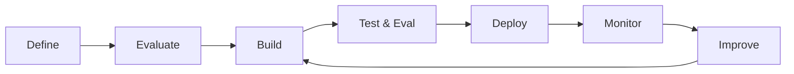

# Chapter 20: Building AI Applications

Building AI applications requires managing the full lifecycle: problem definition, architecture, evaluation, deployment, and ongoing operations.

---

## AI Application Lifecycle



The feedback loop from Monitor → Improve → Build is what most teams underinvest in.

---

## Retrieval-Augmented Generation (RAG)

RAG is the most common enterprise AI pattern: combine a vector search over your documents with an LLM for answer generation.

**Core pipeline:**

1. **Ingest** — chunk documents, embed them, store in vector database
2. **Retrieve** — embed the query, find similar chunks via nearest-neighbor search
3. **Generate** — pass retrieved chunks + query to LLM; generate grounded response

**Key decisions:** Chunk size, embedding model, number of retrieved chunks, reranking, prompt design.

See the detailed [RAG section in Chapter 20](#retrieval-augmented-generation-rag) and the [Developer Toolkit](toolkit.md) for architecture diagrams.

---

## AI Agents

Agents extend single-turn AI to multi-step tasks by giving the model tools it can invoke.

**Minimum viable agent:**

```python
# Pseudocode
while not done:
    thought = model.think(context, tools)
    if thought.is_final_answer:
        return thought.answer
    result = execute_tool(thought.tool_call)
    context.append(result)
```

**Risk profile:** Agents can take real-world actions. Default to minimal tool permissions and human confirmation for consequential actions.

---

## Workflow Orchestration

For multi-step AI workflows, use an orchestration framework rather than hand-rolling:

- **LangChain / LlamaIndex** — Python; rich ecosystem; can be complex
- **Semantic Kernel** — .NET and Python; Microsoft ecosystem
- **Direct API with state machine** — simple, explicit, easier to debug

Simpler orchestration is easier to monitor and debug. Add complexity only when needed.

---

## AI-Assisted Software Engineering

Practical use of AI in the development workflow:

- **Code completion** — Copilot, Cursor, Cline; highest adoption, highest ROI for developers
- **Code review** — AI review as first pass before human review
- **Test generation** — generate test cases from function signatures and docstrings
- **Documentation** — generate and maintain code documentation
- **Debugging** — AI-assisted root cause analysis

Evaluate on your codebase. AI code tools perform better on common languages and patterns.

---

## Key Takeaways

- RAG is the right default for enterprise knowledge applications. Start here before custom models.
- Agent complexity should be proportional to the problem. Start simple.
- The operate phase (monitoring, improvement) requires as much investment as the build phase.

**Common mistake:** Building an elaborate agent pipeline for a problem that a well-designed RAG system or even a good prompt would solve.
