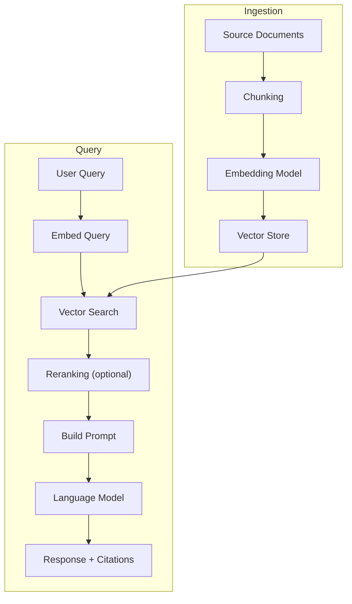

# Developer Toolkit

---

## RAG System Architecture Diagram



---

## AI System Security Checklist

**Input controls**
- [ ] External content treated as untrusted
- [ ] System prompt separated from user/document input
- [ ] Input length limits enforced
- [ ] PII not included in prompts sent to external APIs

**Output controls**
- [ ] PII scanning before returning to users
- [ ] Format validation for structured outputs
- [ ] Content filtering applied where required
- [ ] High-stakes outputs require human review

**Access controls**
- [ ] API keys stored in secrets manager (not code or env files)
- [ ] Retrieval enforces document-level access control
- [ ] Multi-tenant systems isolate tenant data
- [ ] Audit logging enabled for all AI calls

**Agent-specific**
- [ ] Minimal tool permissions (principle of least privilege)
- [ ] Destructive/irreversible actions require human confirmation
- [ ] Rate limits on automated actions
- [ ] Prompt injection test cases in test suite

---

## Evaluation Framework Template

```python
# Pseudocode for a basic eval pipeline

TEST_CASES = [
    {"input": "...", "expected_contains": "...", "should_not_contain": "..."},
    # ...
]

def run_eval(system, test_cases):
    results = []
    for case in test_cases:
        response = system.query(case["input"])
        passed = (
            case["expected_contains"] in response
            and case["should_not_contain"] not in response
        )
        results.append({"case": case, "response": response, "passed": passed})
    
    pass_rate = sum(r["passed"] for r in results) / len(results)
    return pass_rate, results
```

---

## AI Blueprint: Internal Knowledge Assistant

```
Components:
  - Document ingestion pipeline (chunking + embedding)
  - Vector database (pgvector or Weaviate)
  - Query API (FastAPI or equivalent)
  - LLM with citation instructions in system prompt
  - Access control layer (document-level permissions)
  - Evaluation pipeline (retrieval recall + answer quality)
  - Monitoring dashboard (latency, quality, cost)

Key prompts:
  - System: "Answer using only the provided documents. Cite [doc_id] for each claim."
  - Fallback: "I don't have information on that in the available documents."

Acceptance criteria:
  - Retrieval recall > 85% on golden test set
  - Answer faithfulness > 90% (LLM-as-judge)
  - P95 latency < 3s
  - Zero cross-tenant data leakage
```

---

## Cost Tracking Reference

| Model tier | Approximate cost | Use for |
|---|---|---|
| Frontier (GPT-4o, Claude Sonnet) | ~$3–15 / 1M tokens | Complex reasoning, high-stakes outputs |
| Mid-tier (GPT-4o-mini, Haiku) | ~$0.10–0.60 / 1M tokens | Routine tasks, high volume |
| Embedding models | ~$0.02 / 1M tokens | Ingestion and retrieval |
| Batch API (async) | ~50% discount | Non-real-time processing |

*Prices change frequently. Always check current provider pricing.*
